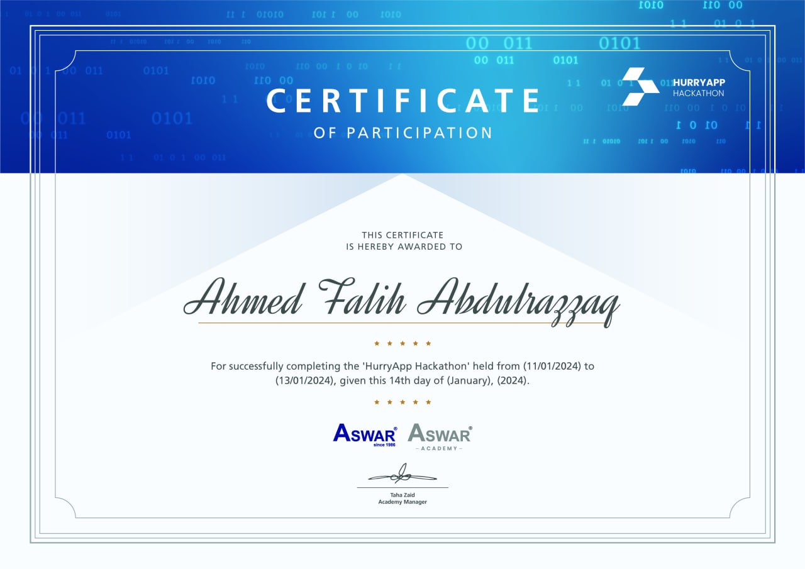

<h1 align="center">
  
</h1>
<h2 align="center">
<pre><i>Hey there! I'm Ahmed.😀</i></pre>
</h2>

<h3> 👨🏻‍💻 &nbsp;About Me </h3>

- 💭 &nbsp; Diving deeper into the realm of **Web Development, Networking and Robots**
- 🏠 &nbsp; Living in **IRAQ**
- 👨‍🎓 &nbsp; I'm student at **Maarif** school

 

🧾 My achievements

-  👏 &nbsp; Verified bot developer in **Discord**.
- 🤖 &nbsp; `2nd` and `3rd` place in the **3rd national Robotics championship** in Iraq.
- 🎋 &nbsp; First place at **Coolest Projects Iraq**, certified by RasperyPI
- 🐱‍👤 &nbsp; Winner at the first **Hurry App** Hackathon by `Aswar Academy` and `HUB 200` (as UI Designer/Frontend Developer)
 

✨ Certificates

  

<h2 align="center">

</h2>
 

<h1 align="center"> وإني وإن كنْتُ الأخيرَ زمانُهُ ... لآتٍ بما لم تَسْتَطِعْهُ الأوائلُ</h1>

## Contact me
discord: 2pz

email: ahmedfalihalkraidi@gmail.com

insta: z7p.z

  

